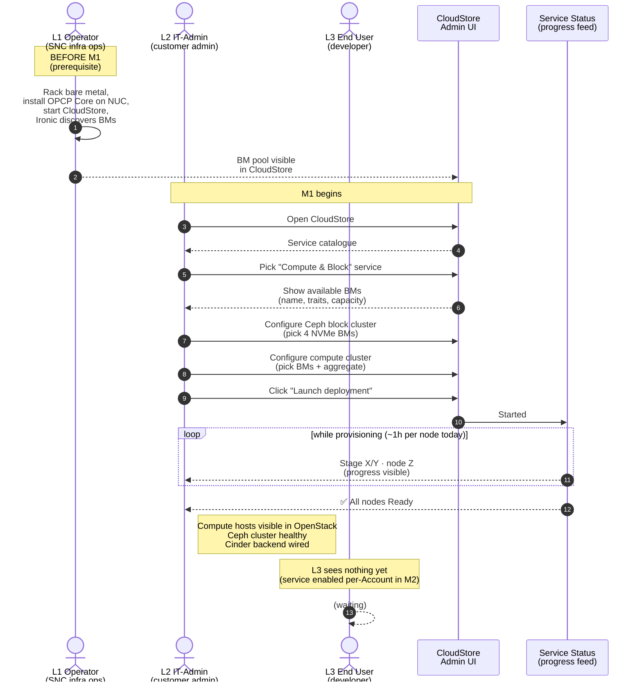
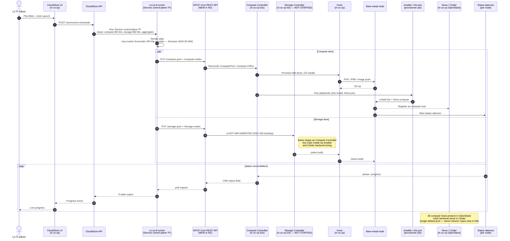

# Milestone 1 · "Install the service"

> **User story:** *As an **IT Admin**, I want to install the Compute & Block service by selecting which physical machines will be used for compute and which for storage, so that the service automatically sets up and makes those servers ready to use in OPCP Core OpenStack.*
>
> **Definition of Done:** the host servers are deployed and available in OpenStack. *(2026-05-13)* **Plus** a Nova **host aggregate** for CloudStore CP VMs stood up — local-storage only, no Ceph, no HA — so cs-cp + cbs-cp can deploy on OpenStack VMs in M2.
> **Out of scope for M1:** service control plane (cbs-cp), L3 account activation, UI, proxies, Horizon, node lifecycle.
>
> **Scope update 2026-05-13:** **New M1 Task** — `[MS1][Compute] Provide Nova host aggregate for CloudStore CP VMs` (replaces [`SOV-18`](SOV-18)). Draft in [`jira/SOV-730-nova-aggregate-for-cp-vms.md`](../jira/SOV-730-nova-aggregate-for-cp-vms.md). Local-storage VMs only (no Ceph, no HA). Required as M1 substrate so cs-cp + cbs-cp can run on OpenStack VMs in M2.
>
> ↑ Index page: [`milestones.md`](../milestones.md). Source: Jira LVL2-18373.

---

## Visual


> *Polished cartoon illustration generated from the [image-gen prompt](visuals/M1-image-prompt.md). The structural composition reference is [`visuals/M1-layout.svg`](visuals/M1-layout.svg).*

---

## Personas — who acts, who waits

| Tier | Persona | In M1, this persona… |
|---|---|---|
| **L1** | **Operator** — OVH/SNC platform operator (or, on-prem, the customer's infra-ops team) | …did the **prerequisite work** before M1 began: racked the bare metal, installed OPCP Core on the controller NUC, brought up CloudStore on it, made sure Ironic discovered the BMs and they show up as available. **No live action in M1**. |
| **L2** | **IT-Admin** — the customer's admin operating in the CloudStore | …is the **primary actor**. Opens CloudStore, picks the *Compute & Block* service from the catalogue, selects which BMs become compute vs. storage, clicks install, watches it provision. |
| **L3** | **End User** — the developer / operator inside an account | …is **dormant**. The service exists at the platform level after M1, but no Account has it enabled yet (that's M2). End Users see no change. |

> **Subtle point:** in M1 the L2 IT-Admin is acting on **shared infrastructure** (the BM pool that L1 owns). The L1 ↔ L2 handoff is the BM pool itself — if the pool is empty or wrong, M1 can't run. This is why "Allow creation of VMs w/ local storage for service control planes" sits in M1 (yellow box on the M1 graph) — it pre-conditions the L1 substrate.

---

## Tasks (from the M1 graph — red = Epic, blue = Task)

### CloudStore swimlane
- 🟡 *(in progress)* **Allow creation of VMs w/ local storage for service control planes** — *"how complete is this? to be answered by the OPCP Core Platform team"*
- 🔵 **Define inputs and outputs for CloudStore package**
- 🔴 **Epic: Create CloudStore package for Compute & Block** *(excl. control plane, only setup compute / storage nodes)*
- 🔵 **Implement terraform modules / call OPCP Infra API**
- 🔵 **Create tf provider for OPCP Infra API(s) OR use `http` tf provider**

### OPCP Core Platform swimlane
- 🔵 **Migrate network configuration management away from admin network**
- 🟢 ~~Epic: Implement OPCP Infra API~~ — **already shipped for Compute** (endpoints, `Compute` + `ComputePool` CRD management, basic auth — [Swagger](https://rtstatic.ovhcloud.tools/gor/publiccloud/opcp-infra-api/latest/opcp-infra-api-reference.html)). M1 remaining task: **deploy API + operator together in a real test env and run end-to-end integration test**.
- 🔴 **Extend OPCP Infra API for Storage** (`Storage` + `StoragePool` endpoints + auth + tests) — greenfield, owned by Storage team as part of `SOV-256`.
- 🔵 **API spec** — already exists for Compute (Swagger); extend for Storage as part of `SOV-256`.

### OPCP Core Compute swimlane
- 🔵 **Build Compute Node Goldenimage** — *"can we just take SNC golden images for compute and storage?"* (open question)
- 🔵 **Implement Compute Node Bootstrapping (tf, ansible)**
- 🔵 **Reconfigure nova to allow compute (add nodes, define flavors?)**
- 🔴 **Epic: Implement Compute Node Operator** — bootstraps nodes (incl. OS install & setup), configures OpenStack components
  - **Status: V0 demo'd on Apr 24** — see [`architecture/opcp-core-operator.md`](../architecture/opcp-core-operator.md). End-to-end works. *"Lots of small issues to fix"* + duplicated nova compute records bug seen during demo.

### OPCP Core Storage swimlane
- 🔵 **Build Storage Node Goldenimage**
- 🔵 **Implement Storage Node Bootstrapping (tf, ansible)**
- 🔵 **Reconfigure cinder to allow block storage** — basic single-pool wiring so Cinder can carve volumes from the Ceph cluster. (The **3 tiered Cinder Volume Types** — Standard / High / Insane per [Brief 02](../product-briefs.md#brief-02--block-storage-ceph-rbd-technical-brief) — are deferred to **M4** because the higher tiers likely need different drive specs and benefit from M4's add-node lifecycle.)
- 🔴 **Epic: Implement Storage Node Operator** — bootstraps nodes (incl. ceph install) configures OpenStack components
  - **Status: NOT STARTED** (SOV-256 is in Backlog). Block-storage M1 cannot complete without this.

### Cross-cutting
- 🔵 **Implement status daemon** — reports back status to OPCP operators

### Notes from the M1 graph
- *"red = Epic; Blue = Tasks → does it make sense like this?"* (the assignee asking)
- *"next steps: estimate efforts (the estimation owner) → cut big tasks into smaller ones to better explain the big picture"*
- *"are there tasks missing (indicated by blue boxes with '?')"*

### Gates to start M1
- Compute Controller: **OK (V0 ready)**
- Storage Controller: **MISSING — start now (highest-priority new staffing)**
- REST OPCP Core Controller APIs (per-operator): **partial — Compute side OK, Storage side TBD**

### Open questions just for M1 (also tracked in [`open-questions.md`](../open-questions.md))
- Can we reuse SNC golden images for compute and storage? **the OPCP Core Platform team**
- How complete is *"VMs w/ local storage for service control planes"* actually? **the OPCP Core Platform team**
- Is the OPCP Infra API + tf-provider scope OK? **OPCP Core Platform team**
- Are blue-boxes-with-?'s missing tasks?

---

## Human-facing flow — what each tier *experiences*



**Key UX gaps to track for M1** (see [open-questions.md](../open-questions.md) and [milestones.md cross-milestone risks](../milestones.md#cross-milestone-risks-raised-by-team-in-the-video--jira)):

- 🚩 **Status visibility** — provisioning is ~ 1 hour / node today (20 min Debian install + 40 min CIS hardening). Without live progress feedback the L2 stares at a black box. The "implement status daemon" task in M1 exists for this.
- 🚩 **Golden-image reuse** — open question Q-001: can we reuse SNC golden images so this drops below 1 h?
- 🚩 **Glance image sync** is M2, not M1 — but L2 should know that "service installed" ≠ "VMs can boot" until M2 lands.

---

## Technical internal flow — what *actually happens* under the hood



### Where the work actually sits — clusters & artifacts

```
┌──────────────────────────────────────────────────────────────────────────────┐
│ L1 Operator already prepared:                                                │
│   • Bare metal racked, BMC reachable                                         │
│   • Ironic in OPCP Core has discovered the BMs                               │
│   • CloudStore is running on top of OPCP Core                               │
└──────────────────────────────────────────────────────────────────────────────┘
                                    │ M1 starts
                                    ▼
┌──────────────────── cs-cp (CloudStore control plane) ──────────────────────┐
│ CloudStore UI · CloudStore API · tf-runner                                 │
│   ↳ runs the **Service control-plane TF** for `cloudstore-vm-bs-service`     │
│     (input: BM IDs · output: nothing visible to L2 yet)                      │
└──────────────────────────────────────────────────────────────────────────────┘
                                    │ via REST OPCP Core API (NEW in M1)
                                    ▼
┌──────────────────── oc-cp (OPCP Core control plane on the NUC) ─────────────┐
│ Compute Controller (V0 ready)   ← consumes ComputePool + Compute CRDs      │
│ Storage Controller (NOT STARTED — SOV-256)                                     │
│ Ironic + Ansible inside provisioner job                                 │
│ Nova + Cinder in the OPCP-Core OpenStack (already running on the NUC)        │
└──────────────────────────────────────────────────────────────────────────────┘
                                    │ provisions
                                    ▼
┌──────────────────── Bare-metal nodes (compute + Ceph) ──────────────────────┐
│ Compute node:  k3s (joined to oc-cp) · Nova compute · status daemon          │
│ Storage node:  k3s (joined to oc-cp) · Ceph OSD/MON · status daemon          │
│   ↳ when Storage Controller exists                                             │
└──────────────────────────────────────────────────────────────────────────────┘

cbs-cp (the Service's own control plane with proxies, Horizon, manager UI) is
**not yet provisioned** — that's M2.
```

---

## What's reached at the end of M1

| State | Before M1 | After M1 |
|---|---|---|
| BMs racked & discovered | ✅ (L1 prereq) | ✅ |
| OPCP Core OpenStack on NUC | ✅ (already enabled — see [README "Already done"](../README.md#whats-done)) | ✅ |
| Compute hosts in Nova | ❌ (only the NUC) | ✅ via Compute Controller |
| Ceph cluster + Cinder backend | ❌ | ✅ via Storage Controller *(blocked on SOV-256)* |
| Cinder backend wired (single default pool) | ❌ | ✅ ready for VM attach |
| 3 tiered Volume Types (Standard / High / Insane) | ❌ | ❌ — **M4** (likely needs different drives) |
| Service available to **Accounts** (L3 can use) | ❌ | ❌ — needs M2 (Keystone Controller + proxies + per-account flow) |
| L3 End User can boot a VM | ❌ | ❌ — needs M2 |
| CloudStore VM App UI / VNC console | ❌ | ❌ — M2 |
| Auto-recovery, snapshots, backups | ❌ | ❌ — M2 / M3 / M4 |

> **In one line:** M1 gets you a *populated OpenStack* (Nova hosts + Ceph backend) on shared infrastructure. M2 is what turns that into something an Account's End User can consume.

---

## Cross-references

- **Operator design (Compute V0 + Storage TBD):** [architecture/opcp-core-operator.md](../architecture/opcp-core-operator.md)
- **Where things go (cs-cp / oc-cp / cbs-cp):** [architecture/what-goes-where.md](../architecture/what-goes-where.md)
- **Decisions in play:** [Decision-2026-05-09c](../decisions.md) (one Service for VM+Block) · [Decision-2026-05-09d](../decisions.md) (REST OPCP Core API + tf-provider) *(Decision-2026-05-09i — 3 Cinder Volume Types — applies to M4, not M1.)*
- **Open questions hit by M1:** Q-001 to Q-006 + Q-301 + Q-609 (HW sizing) + Q-610 (Glance sync — actually M2)
- **Other milestones:** [M2](M2-start-a-vm.md) · [M3](M3-deploy-all-components.md) · [M4](M4-make-it-airgapped.md)
