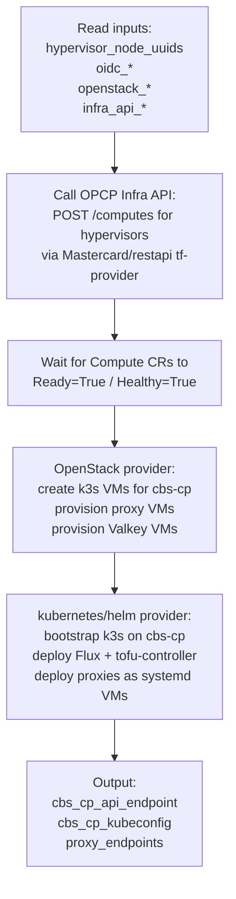
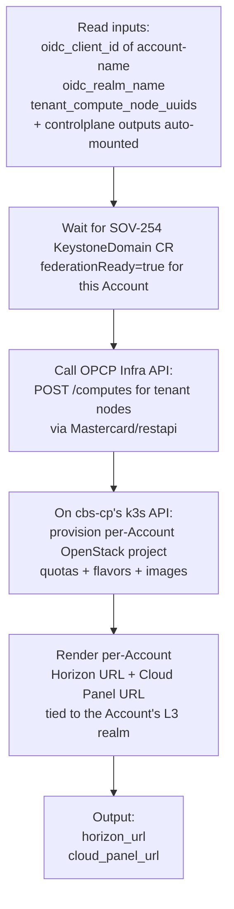

# Architecture — `cloudstore-vm-bs-service` skeleton

> Concrete repo skeleton for the M2 CloudStore Service (`SOV-680`), derived from a template study of the 8 existing `cloudstore-service-core-*` repos (cloned 2026-05-13). This is the **"this is what the repo should look like"** reference for whoever owns SOV-680 implementation.
>
> Companion to:
> - [`cloudstore-service-contract.md`](cloudstore-service-contract.md) — the *what* and *why* of the CloudStore Service model
> - [`what-goes-where.md`](what-goes-where.md) — where cbs-cp + proxies + per-Account TF land
> - [`opcp-core-operator.md`](opcp-core-operator.md) — the OPCP Infra API this Service's TF calls

---

## 1. What we learned from the template study

We surveyed 8 production Service repos: `cloudstore-service-core-{api, cert-manager, cnpg, externaldns, harbor, harbor-post-setup, keycloak, keycloak-post-setup}`.

### Three findings that matter for SOV-680

**(1) All `core-*` services use a *flat* `terraform/`, not the `controlplane/` + `dataplane/` split.**

```
cloudstore-service-core-keycloak/
├── cloudstore.yaml             # Minimal: version + name + descriptions + docker_images
└── terraform/
    ├── main.tf
    ├── variables.tf
    ├── outputs.tf
    └── providers.tf
```

That's because Core Services install **once** into cs-cp (no per-Account dataplane). Their `cloudstore.yaml` has **no `control:` or `data:` blocks** — they don't need inputs/outputs/permissions/target/prerequisites.

**`cloudstore-vm-bs-service` is NOT a Core Service.** It has a controller (cbs-cp) **and** a per-Account dataplane (VM/Block enable). So we follow the **marketplace Service** layout from `ref_repository_structure.md`:

```
cloudstore-vm-bs-service/
├── cloudstore.yaml
├── docs/public/img/service-icon-{light,dark}.png
└── terraform/
    ├── controlplane/          # cbs-cp + 6 proxies + Valkey
    │   ├── main.tf
    │   ├── variables.tf
    │   ├── outputs.tf
    │   ├── providers.tf
    │   └── README.md
    └── dataplane/             # Per-Account VM/Block enablement
        ├── main.tf
        ├── variables.tf
        ├── outputs.tf
        ├── providers.tf
        └── README.md
```

**(2) The repo is built from a Copier template** — every service repo ships the Service Packager tooling (`.makefiles/`, `bin/tf-updater`, `cmd/tf-updater/main.go`, `docker/Dockerfile`, `.cz.yaml`, `.copier-answers.yml`, etc.). You **don't** write this — `copier copy <template>` generates it for you.

```bash
# From cloudstore-documentation/docs/how_to_guides/howto_create_service_in_cloudstore.md
export TEMPLATE_VERSION="v0.6.2"
export SERVICE_NAME="cloudstore-vm-bs-service"
copier copy -r ${TEMPLATE_VERSION} \
  git@github.com:OVH-Goldorack/cloudstore-service-template.git \
  $SERVICE_NAME
```

**(3) TF modules are externalised to a separate registry** — Core Services pull from `artifactory.ovhcloud.tools/cloudstore-default-terraformModule__cloudstore/<service>/ovh` rather than vendoring TF inline. Example from `cloudstore-service-core-keycloak/terraform/main.tf`:

```hcl
module "keycloak" {
  source  = "artifactory.ovhcloud.tools/cloudstore-default-terraformModule__cloudstore/keycloak/ovh"
  version = "0.5.8"
  service       = var.service
  deployment_id = var.deployment_id
  # …
}
```

For `cloudstore-vm-bs-service`, we have a choice: vendor the TF (large but self-contained) or extract into its own `vm-bs/ovh` module. **Decision parked — Q-228** (new, see § 8).

---

## 2. Proposed `cloudstore.yaml`

Using the **authoritative** schema from `cloudstore-service-core-keycloak/docs/reference/ref_cloudstore_yaml.md`. Yesterday's `cloudstore-documentation` how-to used the wrong field names — see [`cloudstore-service-contract.md`](cloudstore-service-contract.md) § 2 for the closure of Q-225 / Q-227.

```yaml
# ── Manifest version + general info ──
version: v1alpha2
name: "cloudstore-vm-bs-service"
description_short: "Compute + Block service for OPCP."
description: |
  One-install cbs-cp control plane (k3s VMs + OpenStack APIs + 6 SNC proxy groups +
  Valkey) on hypervisor BMs, with per-Account VM + Block enablement.
icon:
  light: "docs/public/img/service-icon-light.png"
  dark:  "docs/public/img/service-icon-dark.png"
hidden: false

# ── Docker images mirrored to Harbor at build time ──
docker_images:
  - { name: "caddy",        tag: "2.x" }
  - { name: "valkey/valkey", tag: "8.x" }
  # OpenStack + k3s + Apache + mod_openidc images TBD

# ── Controlplane (the controller — cbs-cp) ──
control:
  prerequisites:
    description: |
      OPCP Core (oc-cp) running; at least N hypervisor BMs available
      (where N = 3 for HA cbs-cp + 1 per proxy group + N for compute).

  target:
    baremetal:
      pools:
        - name: hypervisor-nodes
          tf_variable_name: hypervisor_node_uuids
        # If we also stand up Block storage in M1 controlplane (TBC vs SOV-256 split):
        - name: storage-nodes
          tf_variable_name: storage_node_uuids

  permissions:
    groups:
      - name: vm-bs-admins
        roles: [vm-bs-admin]

  inputs:
    # Inputs the IT admin fills in the CloudStore UI
    enable_horizon:
      format: ""
    enable_block_pool_tiering:
      format: ""

    # System-provided by CloudStore (no UI prompt)
    oidc_client_id:    { provided: true }
    oidc_client_secret: { provided: true }
    oidc_issuer_url:   { provided: true }
    oidc_wellknown_url: { provided: true }
    oidc_realm_name:   { provided: true }
    ca_crt:            { provided: true }
    internal_dns_server: { provided: true }
    dns_tsig_key:      { provided: true }
    dns_tsig_algorithm: { provided: true }
    dns_tsig_secret:   { provided: true }
    # When target.baremetal is set, CloudStore auto-injects the OpenStack creds:
    openstack_auth_url: { provided: true }
    openstack_application_credential_id:     { provided: true }
    openstack_application_credential_secret: { provided: true }

    # OPCP-Infra-API credentials (custom — provided by SOV-674 / SOV-683)
    infra_api_endpoint:    {}
    infra_api_bearer_token: { format: "" }  # mounted via Secret (SOV-683)

    # NOTE: `service` + `deployment_id` always auto-injected — don't list them with provided.

  outputs:
    cbs_cp_api_endpoint:
      format: "url"
    cbs_cp_kubeconfig:
      format: "yaml"
    proxy_endpoints:
      format: "yaml"      # list of {group, fqdn}

# ── Dataplane (the App — per-Account VM/Block enable) ──
data:
  prerequisites:
    description: |
      Controller deployed; Account exists in CloudStore (POST /api/v1/accounts
      created the L3 realm); SOV-254 Keystone Controller has fired (Keystone
      domain + federation mapping in place).

  target:
    baremetal:
      pools:
        # Per-Account compute nodes selected by the IT admin
        - name: tenant-compute-nodes
          tf_variable_name: tenant_compute_node_uuids

  permissions:
    groups:
      - name: vm-users
        roles: [vm-user]

  inputs:
    oidc_client_id:    { provided: true }   # L3 client in account-{name} realm
    oidc_realm_name:   { provided: true }   # account-{name}
    # Controlplane outputs are auto-mounted via Secret/<svc>-<controlplane-id>-output
    # so cbs_cp_api_endpoint / kubeconfig are reachable here without redeclaring.

  outputs:
    horizon_url:
      format: "url"
    cloud_panel_url:
      format: "url"
```

### What's open

- **The two `target.baremetal.pools` entries in `control:` (hypervisor + storage):** may collapse into one if SOV-256 owns the Storage controller separately and `cbs-cp` only manages hypervisors. Confirm with Storage track.
- **Custom inputs `infra_api_endpoint` + `infra_api_bearer_token`:** these aren't in the documented `provided: true` list. They'll be plumbed via CloudStore's "user input" path (entered by IT admin during install) or as a `Secret` reference via `varsFrom`. Worth confirming the canonical pattern with the team — possibly a Q-229.

---

## 3. `terraform/controlplane/` — what cbs-cp's TF actually does

The controlplane module's job: stand up the entire cbs-cp + proxy infrastructure on top of OPCP Core. Skeleton:

```
terraform/controlplane/
├── main.tf            # Top-level orchestration
├── variables.tf       # All inputs declared (matching cloudstore.yaml's input keys)
├── outputs.tf         # All outputs declared (matching cloudstore.yaml's output keys)
├── providers.tf       # kubernetes + helm + restapi + openstack providers
└── README.md          # Auto-generated by terraform-docs
```

### Step sequence (proposed)



### Modules likely needed

- **`mastercard/restapi`** — Q-003 closed; the only TF provider for OPCP Infra API calls
- **`opentofu/openstack`** — for VM provisioning on OPCP Core
- **`opentofu/kubernetes` + `opentofu/helm`** — for cbs-cp bootstrap
- **`opentofu/null` + `cloudinit`** — for systemd-unit deployment of proxy VMs (custom Caddy image per SOV-680 source PDF)

### Local TF modules (vendored under `terraform/controlplane/modules/`)

- `modules/compute-via-infra-api/` — wraps the Mastercard/restapi calls to OPCP Infra API for `Compute` CRs (this is what `SOV-684` Step 5 implements — the actual code lives **here**, not in a separate repo)
- `modules/cbs-cp-bootstrap/` — k3s + Flux + tofu-controller bootstrap (the recursive-CloudStore-Core pattern at the cbs-cp layer)
- `modules/proxy-vm/` — provisions one proxy VM with cloud-init + Netplan + nftables + Caddy (per the Proxies Deep Dive)
- `modules/valkey-cluster/` — provisions the two Valkey instances (L2 + L3) on cs-cp's Regional CP

### Inputs we still need to nail down

- Where does the **proxy image** come from? Q-222 in open-questions — likely Harbor reference after SOV-680 owns it.
- Where does the **OPCP cert chain** for backend TLS get baked in? Q-223 in open-questions.
- Do we ship **6 proxy groups or 2** in M2? Q-224 in open-questions.

---

## 4. `terraform/dataplane/` — what the per-Account TF does

The dataplane module runs **once per Account** the IT admin enables this Service for. Its job is the per-Account VM/Block enablement.

```
terraform/dataplane/
├── main.tf
├── variables.tf
├── outputs.tf
├── providers.tf
└── README.md
```

### Step sequence (proposed)



### Modules likely needed

- **`mastercard/restapi`** — same as controlplane
- **`opentofu/openstack`** + the cbs-cp's OpenStack endpoint (from controlplane output) — for per-Account project provisioning

### Open: the SOV-254 wait

Step B above is the **Q-208 seam**. Two options:
- (a) dataplane TF *polls* until `KeystoneDomain.status.federationReady=true`
- (b) the user (IT admin) is expected to have run the Keystone Controller via a separate trigger before deploying the App

(a) is more user-friendly; (b) is what the SNC ticket process does today. Decision parked — see Q-208 in [`open-questions.md`](../open-questions.md).

---

## 5. Cross-cutting concerns

### Secrets plumbing

Per the Service Packager `ref_repository_structure.md`, secrets enter the TF runner via three CloudStore-managed K8s `Secret`s:

| Secret | Source |
|---|---|
| `<service>-<id>-secrets` | User-supplied sensitive inputs (UI-entered, masked) |
| `<service>-<id>-oidc-secret` | `oidc_client_id` + `oidc_client_secret` from Keycloak L2 (controlplane) or L3 (dataplane) |
| `<service>-<id>-provided-secret` | Other CloudStore-provided sensitive values (OpenStack app creds, DNS TSIG, etc.) |

For our SOV-683 `infra_api_bearer_token`: probably lives in `<service>-<id>-secrets` (user-supplied), OR — if CloudStore can reference an external Secret directly (Q-229 candidate) — pulled from `Secret/opcp-infra-operator/opcp-infra-operator-infra-api-keys/.data.cloudstore` by an out-of-band mechanism. Confirm.

### OIDC plumbing

CloudStore creates a **Keycloak L2 client** for each controller deploy and a **Keycloak L3 client** for each app deploy (in the `account-{name}` realm). The TF receives `oidc_client_id` + `oidc_client_secret` + `oidc_issuer_url` automatically.

Use these to:
- Federate cbs-cp's OpenStack Keystone with CloudStore Keycloak L2 (controlplane)
- Federate per-Account access to cbs-cp's OpenStack Keystone with CloudStore Keycloak L3 (dataplane)

Note: the SOV-254 Keystone Controller does the OPCP-side of this federation (the 6-resource chain). The dataplane TF probably **doesn't** create the federation directly — it waits for SOV-254 to complete and consumes the result.

### Cert plumbing

CA chain auto-injected via `ca_crt` (provided variable). The proxy VMs' `/etc/caddy/certificates` trust store gets populated from this + any per-target backend certs that cbs-cp creates (Keystone, Keycloak federation IdP, etc.).

### DNS plumbing

PowerDNS TSIG creds (`dns_tsig_*`) + `internal_dns_server` are auto-injected. cbs-cp's TF uses these to register its own service-FQDN + proxy-FQDNs into the cs-cp DNS zone.

---

## 6. Build + release flow (standard, comes from the template)

```bash
# Bootstrap once
copier copy -r v0.6.2 \
  git@github.com:OVH-Goldorack/cloudstore-service-template.git \
  cloudstore-vm-bs-service
cd cloudstore-vm-bs-service

# Develop ↔ commit ↔ release loop
# … edit cloudstore.yaml + terraform/controlplane/* + terraform/dataplane/*
git commit -m "feat: add proxy provisioning to controlplane"
git push

# Release (commitizen + semver auto-bump)
make add_release_version          # feat: → minor, fix: → patch, BREAKING CHANGE: → major

# Package + push (one-shot, requires Harbor creds)
make registry_login OCI_USERNAME=sa-cs-team-vm-bs-write
make generate_package             # → build_oci → push_oci → mirror_docker_images
```

`make generate_package` produces:
- One OCI artifact at `9501yd0v.eu-west-par.container-registry.ovh.net/services/cloudstore-vm-bs-service:<tag>`
- Mirrored copies of every entry in `docker_images:` (so cbs-cp can pull them air-gapped — M4 requirement)

ServiceCopier on the CloudStore side syncs the catalog hourly (or restart cs-cp's `cloudstore-api` to force a sync).

---

## 7. Repo skeleton — what to commit on day 1

Things you'd write on day 1 of SOV-680:

```
cloudstore-vm-bs-service/
├── cloudstore.yaml              # § 2 above
├── docs/
│   └── public/img/
│       ├── service-icon-light.png
│       └── service-icon-dark.png
├── terraform/
│   ├── controlplane/
│   │   ├── main.tf              # `module "compute_via_infra_api"`, `module "cbs_cp"`, `module "proxies"`, etc.
│   │   ├── variables.tf         # 1:1 with cloudstore.yaml `control.inputs`
│   │   ├── outputs.tf           # 1:1 with cloudstore.yaml `control.outputs`
│   │   ├── providers.tf         # restapi + openstack + kubernetes + helm
│   │   ├── README.md            # generated by terraform-docs
│   │   └── modules/             # local TF modules (proxy-vm, cbs-cp-bootstrap, etc.)
│   └── dataplane/
│       ├── main.tf
│       ├── variables.tf         # 1:1 with cloudstore.yaml `data.inputs`
│       ├── outputs.tf           # 1:1 with cloudstore.yaml `data.outputs`
│       ├── providers.tf         # restapi + openstack
│       ├── README.md
│       └── modules/
├── docker_images.yaml           # If maintaining outside cloudstore.yaml (some templates do this)
├── README.md
└── .copier-answers.yml          # Generated by `copier copy`
```

Things you DON'T write — they come from the template:

```
.cds/workflows/                  # CDS CI
.makefiles/                      # docker.mk, terraform.mk, packager.mk, etc.
bin/tf-updater                   # Binary (replaces OCI module refs at build time)
cmd/tf-updater/main.go           # Source
docker/Dockerfile                # Packager image
.copier-answers.yml
.cz.yaml                         # Commitizen
.pre-commit-config.yaml          # terraform-docs + commitizen hooks
.terraform-docs.yml              # tfdocs config
Makefile + go.mod + go.sum
```

---

## 8. Testing against minint today — the early-dev workaround

> **Note from Thomas Wiebe (EXT) ad-hoc call, 2026-05-13.** The operator's Compute Controller currently **fails completing node provisioning** because the provisioner TF module is missing upstream. But the *API surface* works fine — so `cloudstore-vm-bs-service` development can start now against minint, with the end-to-end "BM is Nova-joined" gate the only thing pending the missing TF module.

This is the recipe to use **right now** for SOV-684 (Step 5) development + integration test, before the missing TF module lands.

### Setup

1. **Swagger UI** (proxy required): <https://opcp-infra-api.minint.bmp.ovhgoldorack.ovh/swagger/>
2. **Auth token — pick the right one for the use case:**
   - `cloudstore` token → for the final `cloudstore-vm-bs-service` TF (production path)
   - `opcp-internal` token → for **ad-hoc dev / Swagger testing** (this section)

   ```bash
   KEY=$(kubectl -n opcp-infra-operator get secret opcp-infra-operator-infra-api-keys \
     -o jsonpath='{.data.opcp-internal}' | base64 -d)
   # Click "Authorize" in the Swagger UI → paste:  Bearer <TOKEN>
   ```

### Smoke-test the CR creation chain

```json
// Step 1 — create a default ComputePool (uses chart's defaultPoolTemplate)
POST /api/v1/computepools
{ "name": "default" }
// → 201 Created

// Step 2 — create a Compute, referencing the default pool + pinning to a BM node
POST /api/v1/computes
{
  "name": "<compute-name>",
  "pool": "default",
  "vars": {
    "availability_zone": "nova::<NODE_UUID>"
  }
}
// → 201 Created
```

### What works vs. what fails today

| What | Status |
|---|---|
| Authentication via Bearer token | ✅ works |
| `POST /api/v1/computepools` (with or without source/workingDirectory) | ✅ works |
| `POST /api/v1/computes` referencing the pool | ✅ works — CR appears in `opcp-infra-operator` namespace |
| Compute Controller picking up the CR | ✅ works — provisioner Job is spawned |
| Provisioner Job completing | ❌ **fails today** — TF module is missing upstream |
| `Ready=True` / `Healthy=True` on the CR | ❌ blocked on the above |
| BM joining Nova end-to-end | ❌ blocked on the above |

### What this unblocks for SOV-680 / SOV-684

- **SOV-684 (Step 5)**: the Mastercard/restapi TF integration + the watch-status polling logic can both be developed + integration-tested *now*, against the minint API. The full E2E gate ("BM is Nova-joined") waits for the missing TF module.
- **SOV-680 (parent package)**: the `cloudstore.yaml` shape + `terraform/controlplane/` TF can be drafted + iterated against the live minint API instead of speculating.
- **Owner of the missing TF module**: TBC — likely OPCP Core Platform (Guillaume Audic / Pierre-Yves Aillet). New **Q-234** below.

---

## 9. Open questions

| ID | Question |
|---|---|
| **Q-228** *(new 2026-05-13)* | **Vendor the TF or extract as a module?** The 8 Core Services all `source = "artifactory.ovhcloud.tools/cloudstore-default-terraformModule__cloudstore/<name>/ovh"` — externalising their TF to a separate module repo with semver versioning. `cloudstore-vm-bs-service` could do the same (clean, reusable, but adds a 2nd repo to maintain) or vendor everything inline (single repo, less moving parts, but bigger artefact). |
| **Q-229** *(new 2026-05-13)* | **Can `cloudstore.yaml` inputs reference external K8s Secrets directly** (e.g. for the SOV-683 minint creds in `opcp-infra-operator` namespace), or do all sensitive values have to go through the user-input → `<service>-<id>-secrets` path? Affects whether SOV-674's plumbing wires the Bearer token via a UI prompt or via a CRD `varsFrom` reference. |
| **Q-234** *(new 2026-05-13, from Thomas Wiebe ad-hoc call)* | **When does the missing provisioner TF module land?** Today the operator picks up `Compute` CRs but fails to complete provisioning because the provisioner TF module isn't in place. This blocks the E2E acceptance gate for SOV-684 (Step 5) and the "minint setup is fully functional" gate for SOV-256 / SOV-253. Owner: likely OPCP Core Platform (Guillaume Audic / Pierre-Yves Aillet). |

---

## 10. Source material

- `cloudstore-service-core-keycloak/` *(cloned outside this repo — canonical Service Packager docs source, `docs/reference/ref_*.md`)*
- `cloudstore-service-core-{api,cert-manager,cnpg,externaldns,harbor,harbor-post-setup,keycloak-post-setup}/` *(cloned outside this repo — 7 more production examples)*
- See [`EXTERNAL-REPOS.md`](../../../../../_workspace/EXTERNAL-REPOS.md) for the canonical inventory + clone commands.
- [`cloudstore-service-contract.md`](cloudstore-service-contract.md) — *what* a Service is + the auth/deploy model
- [`opcp-core-operator.md`](opcp-core-operator.md) — the OPCP Infra API this Service calls
- [`Proxies Deep Dive`](../../../../opcp-core/architecture/conceptions/proxies/summary.md) — what the proxy-VM module provisions

External — not yet cloned:
- `cloudstore-service-template` (GitHub: `OVH-Goldorack/cloudstore-service-template`) — the Copier template repo
- `artifactory.ovhcloud.tools/cloudstore-default-terraformModule__cloudstore/*/ovh` — the externalised TF module registry
